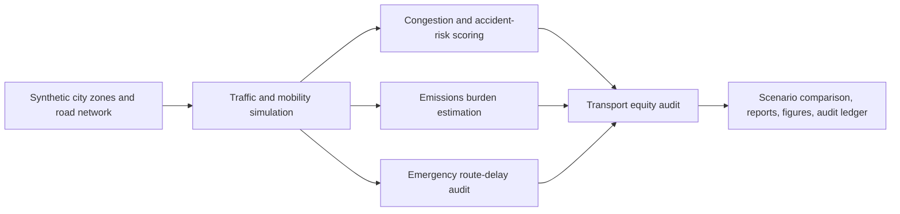

# Smart City Mobility Risk Digital Twin

<p align="center"><strong>Independent research-grade smart city mobility risk digital twin for simulating traffic congestion, accident risk, emissions, emergency routes, and transport equity using synthetic urban mobility data.</strong></p>

<p align="center">
  <a href="../../actions/workflows/python-checks.yml"></a>
  <a href="LICENSE"></a>
  
  
</p>

> **Independent planning boundary:** this repository uses fictional synthetic zones, roads, transit stops, emergency facilities, vehicles, traffic traces, and policy scenarios by default. It is an independent planning simulator only. It is not official traffic-control software, emergency dispatch software, city policy certification, road-safety certification, or public infrastructure control software.

---

## Research objective

Can a smart city mobility risk digital twin simulate traffic congestion, accident risk, emissions, emergency response delays, and transport equity gaps to support transparent urban mobility planning?

| Research question | Evidence generated locally |
| --- | --- |
| Where are congestion hotspots? | Congestion and road-vulnerability risk tables |
| Which segments have elevated accident risk? | Weather, incident, heavy-vehicle, and congestion risk scores |
| Which scenarios reduce emissions burden? | Synthetic emissions estimates and scenario comparison |
| Which zones face emergency route delay? | Emergency-route audit by zone and scenario |
| Are mobility burdens equitably distributed? | Transport-equity burden and review flags |
| Can planning experiments be reproduced? | Hash-chained audit ledger |

---

## Architecture

<p align="center"></p>



---

## Run today — no real city data needed

```bash
python scripts/run_synthetic_mobility_lab.py
```

Windows quick start:

```bat
cd %USERPROFILE%\smart-city-mobility-risk-digital-twin
git pull

py -m venv .venv
.venv\Scripts\activate

python -m pip install --upgrade pip
python -m pip install -r requirements.txt
python scripts/run_synthetic_mobility_lab.py
```

Optional controls:

```bash
python scripts/run_synthetic_mobility_lab.py --zones 18 --segments 54 --time-steps 120 --seed 42
```

---

## Generated local outputs

```text
outputs/results/synthetic_city_zones.csv
outputs/results/synthetic_road_network.csv
outputs/results/synthetic_emergency_facilities.csv
outputs/results/synthetic_transit_stops.csv
outputs/results/synthetic_traffic_traces.csv
outputs/results/synthetic_scenario_traces.csv
outputs/results/synthetic_congestion_accident_risk.csv
outputs/results/synthetic_emissions_estimate.csv
outputs/results/synthetic_emergency_route_audit.csv
outputs/results/synthetic_transport_equity_audit.csv
outputs/results/synthetic_scenario_comparison.csv
outputs/results/synthetic_mobility_risk_summary.json
outputs/reports/synthetic_mobility_risk_report.md
outputs/audit/mobility_risk_audit_log.jsonl

outputs/figures/synthetic_congestion_risk.png
outputs/figures/synthetic_accident_risk.png
outputs/figures/synthetic_emissions_burden.png
outputs/figures/synthetic_emergency_delay.png
outputs/figures/synthetic_transport_equity.png
outputs/figures/synthetic_scenario_comparison.png
```

---

## Scenario policies included

| Scenario | Purpose |
| --- | --- |
| `baseline` | No-intervention synthetic baseline |
| `congestion_pricing` | Peak-period demand reduction proxy |
| `emergency_lane_priority` | Priority capacity for emergency corridors and active requests |
| `transit_priority_corridor` | Bus/transit corridor capacity improvement proxy |
| `low_emission_routing` | Heavy-vehicle and stop-start traffic reduction proxy |
| `equity_aware_mobility` | Targeted mobility improvement in high-priority zones |

---

## What the system evaluates

| Area | Examples |
| --- | --- |
| Traffic congestion | Volume-capacity ratio, speed drop, peak demand |
| Accident risk | Incident flags, rain intensity, heavy-vehicle share, congestion |
| Emissions | Synthetic CO2e burden proxy by segment and scenario |
| Emergency routing | Estimated response delay, emergency corridor pressure |
| Transport equity | Transit access gap, mobility burden in high-priority zones |
| Scenario planning | Composite planning score and policy trade-offs |
| Transparency | Risk drivers, scenario rationale, hash-chained audit records |

---

## Independent planning boundary

This project is an independent synthetic planning simulator. Real-world use would require calibrated traffic data, transport-engineering validation, emergency-services review, accessibility review, environmental review, public participation, privacy review, and formal city governance.

The system should never be used as the sole basis for traffic-signal control, emergency dispatch, road closures, congestion pricing decisions, policing, public warnings, infrastructure investment decisions, or official city policy certification.

---

## Repository map

```text
src/mobilitytwin/
  synthetic.py       # fictional zones, road network, transit, facilities, traces
  traffic.py         # scenario simulation
  risk.py            # congestion, accident, and road vulnerability scoring
  emissions.py       # synthetic emissions burden estimates
  emergency.py       # emergency response delay audit
  equity.py          # transport-equity audit
  scenarios.py       # scenario comparison and summary metrics
  audit.py           # hash-chained audit ledger
  visualization.py   # local figures
  reporting.py       # Markdown planning report
scripts/
  run_synthetic_mobility_lab.py
docs/
  methodology.md
  independent_planning_boundary.md
  synthetic_lab.md
  report_template.md
tests/
  test_synthetic.py
  test_scenarios.py
  test_pipeline.py
  test_audit.py
```

---

## Limitations

- Synthetic traces validate the pipeline but do not prove real-world city performance.
- Risk and emissions metrics are transparent planning proxies, not regulatory or engineering certification.
- Emergency delay estimates are review prompts, not dispatch guidance.
- Real deployments require city data governance, field validation, stakeholder review, and human oversight.
