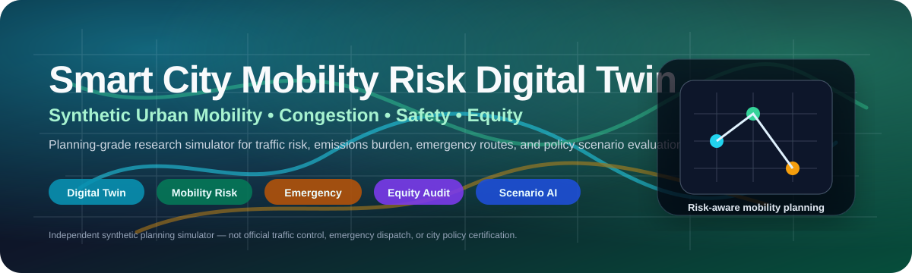
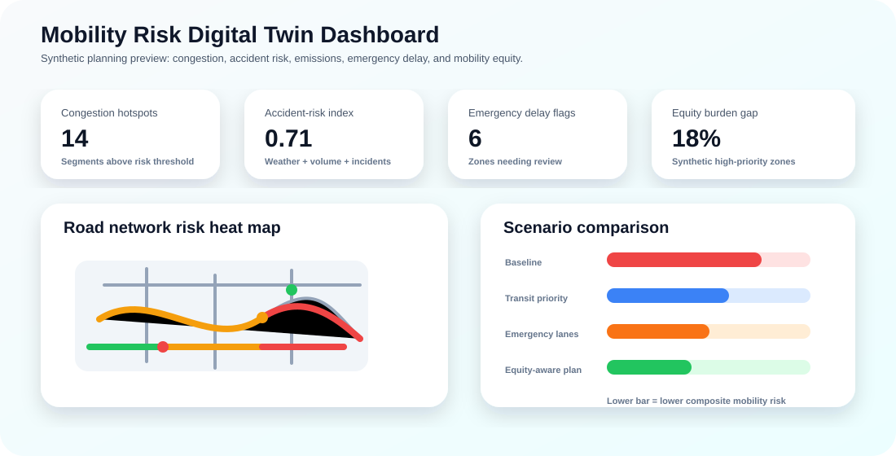
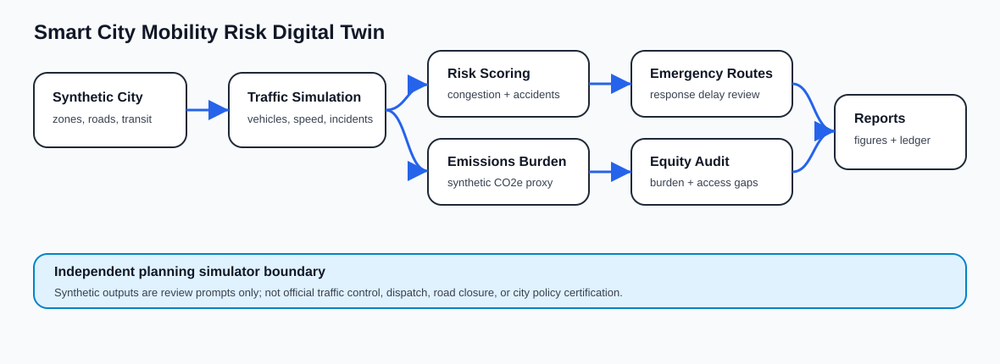
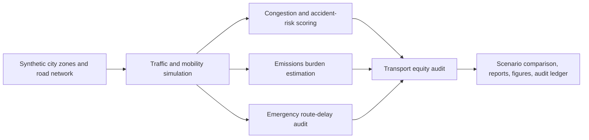
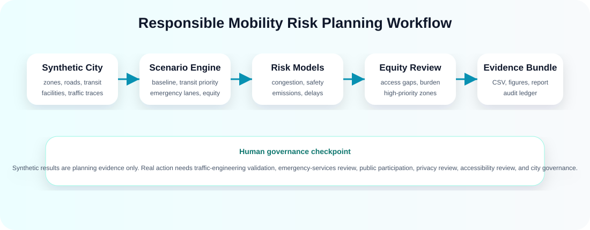

<p align="center">
  
</p>

<h1 align="center">Smart City Mobility Risk Digital Twin</h1>

<p align="center">
  <b>A research-grade synthetic urban mobility digital twin for congestion, accident risk, emissions burden, emergency response delay, scenario planning, and transport-equity auditing.</b>
</p>

<p align="center">
  <a href="../../actions/workflows/python-checks.yml"></a>
  
  
  
  
  
</p>

---

## Overview

**Smart City Mobility Risk Digital Twin** is an independent academic research prototype for studying how synthetic urban mobility systems can be used to evaluate planning trade-offs. It simulates fictional city zones, road segments, transit stops, emergency facilities, vehicles, weather events, traffic traces, and policy scenarios to study congestion, safety, emissions burden, emergency route delays, and mobility equity.

The project is designed around one responsible-research question: **can a transparent digital twin help planners compare mobility-risk scenarios without relying on real city, citizen, or vehicle data?**

It is useful for research and teaching in:

- Smart-city digital twins and urban computing.
- Mobility risk analytics and congestion modeling.
- Accident-risk and road-vulnerability scoring.
- Synthetic scenario planning and policy evaluation.
- Emergency response delay auditing.
- Transport equity and accessibility burden analysis.
- Reproducible planning reports and audit trails.

> **Independent planning boundary:** This repository uses fictional synthetic data only. It is not official traffic-control software, emergency dispatch software, city policy certification, road-safety certification, policing infrastructure, or public infrastructure control software.

<p align="center">
  
</p>

---

## Research objective

Can a smart city mobility risk digital twin simulate traffic congestion, accident risk, emissions burden, emergency response delays, and transport equity gaps to support transparent urban mobility planning?

| Research question | Evidence generated locally |
|---|---|
| Where are congestion hotspots? | Congestion and road-vulnerability risk tables |
| Which road segments show elevated accident risk? | Weather, incident, heavy-vehicle, and congestion risk scores |
| Which scenarios reduce emissions burden? | Synthetic emissions estimates and scenario comparison |
| Which zones face emergency-route delay? | Emergency-route audit by zone and scenario |
| Are mobility burdens equitably distributed? | Transport-equity burden and review flags |
| Can planning experiments be reproduced? | CSV outputs, Markdown report, figures, and hash-chained audit ledger |

---

## Architecture

<p align="center">
  
</p>



<p align="center">
  
</p>

The workflow is intentionally transparent. Each policy scenario produces interpretable risk signals before any real-world planning claim is made.

---

## Core capabilities

| Capability | What it does | Why it matters |
|---|---|---|
| Synthetic city generation | Creates fictional zones, roads, transit stops, emergency facilities, and mobility traces | Enables safe experimentation without real citizen or vehicle data |
| Traffic simulation | Models volume, speed, weather, incidents, and heavy-vehicle pressure | Creates scenario inputs for risk scoring |
| Congestion scoring | Estimates volume-capacity stress and road vulnerability | Highlights bottlenecks and fragile corridors |
| Accident-risk scoring | Combines congestion, incident, weather, and traffic composition signals | Supports safety-oriented planning review |
| Emissions proxy | Estimates synthetic CO2e burden by road segment and scenario | Allows environmental trade-off comparisons |
| Emergency-route audit | Checks response-delay pressure across zones | Identifies areas needing emergency-services review |
| Transport-equity audit | Compares burden and access indicators across zone priority groups | Makes distributional impacts visible |
| Audit ledger | Writes reproducible run records in a hash-chained log | Supports transparent research reporting |

---

## Run today — no real city data needed

```bash
python scripts/run_synthetic_mobility_lab.py
```

Windows quick start:

```bat
cd %USERPROFILE%\smart-city-mobility-risk-digital-twin
git pull

py -m venv .venv
.venv\Scripts\activate

python -m pip install --upgrade pip
python -m pip install -r requirements.txt
python scripts/run_synthetic_mobility_lab.py
```

Optional controls:

```bash
python scripts/run_synthetic_mobility_lab.py --zones 18 --segments 54 --time-steps 120 --seed 42
```

Run tests:

```bash
python -m pytest
```

---

## Generated local outputs

```text
outputs/results/synthetic_city_zones.csv
outputs/results/synthetic_road_network.csv
outputs/results/synthetic_emergency_facilities.csv
outputs/results/synthetic_transit_stops.csv
outputs/results/synthetic_traffic_traces.csv
outputs/results/synthetic_scenario_traces.csv
outputs/results/synthetic_congestion_accident_risk.csv
outputs/results/synthetic_emissions_estimate.csv
outputs/results/synthetic_emergency_route_audit.csv
outputs/results/synthetic_transport_equity_audit.csv
outputs/results/synthetic_scenario_comparison.csv
outputs/results/synthetic_mobility_risk_summary.json
outputs/reports/synthetic_mobility_risk_report.md
outputs/audit/mobility_risk_audit_log.jsonl

outputs/figures/synthetic_congestion_risk.png
outputs/figures/synthetic_accident_risk.png
outputs/figures/synthetic_emissions_burden.png
outputs/figures/synthetic_emergency_delay.png
outputs/figures/synthetic_transport_equity.png
outputs/figures/synthetic_scenario_comparison.png
```

Every output is synthetic and generated locally.

---

## Scenario policies included

| Scenario | Purpose | Main review signal |
|---|---|---|
| `baseline` | No-intervention synthetic baseline | Starting mobility-risk profile |
| `congestion_pricing` | Peak-period demand reduction proxy | Congestion and emissions changes |
| `emergency_lane_priority` | Priority capacity for emergency corridors and active requests | Emergency delay and corridor pressure |
| `transit_priority_corridor` | Bus/transit corridor capacity improvement proxy | Transit access and congestion trade-off |
| `low_emission_routing` | Heavy-vehicle and stop-start traffic reduction proxy | Emissions burden and local rerouting risk |
| `equity_aware_mobility` | Targeted mobility improvement in high-priority zones | Burden reduction and distributional impact |

---

## Evaluation metrics

| Area | Examples |
|---|---|
| Traffic congestion | Volume-capacity ratio, speed drop, peak demand |
| Accident risk | Incident flags, rain intensity, heavy-vehicle share, congestion |
| Emissions | Synthetic CO2e burden proxy by segment and scenario |
| Emergency routing | Estimated response delay and emergency corridor pressure |
| Transport equity | Transit access gap and mobility burden in high-priority zones |
| Scenario planning | Composite planning score and policy trade-offs |
| Transparency | Risk drivers, scenario rationale, and hash-chained audit records |

---

## Responsible planning boundary

This project is an independent synthetic planning simulator. Real-world use would require calibrated traffic data, transport-engineering validation, emergency-services review, accessibility review, environmental review, public participation, privacy review, cybersecurity review, and formal city governance.

The system should never be used as the sole basis for traffic-signal control, emergency dispatch, road closures, congestion-pricing decisions, policing, public warnings, infrastructure investment decisions, or official city policy certification.

---

## Repository map

```text
src/mobilitytwin/
  synthetic.py       # fictional zones, road network, transit, facilities, traces
  traffic.py         # scenario simulation
  risk.py            # congestion, accident, and road vulnerability scoring
  emissions.py       # synthetic emissions burden estimates
  emergency.py       # emergency response delay audit
  equity.py          # transport-equity audit
  scenarios.py       # scenario comparison and summary metrics
  audit.py           # hash-chained audit ledger
  visualization.py   # local figures
  reporting.py       # Markdown planning report
scripts/
  run_synthetic_mobility_lab.py
docs/
  methodology.md
  independent_planning_boundary.md
  synthetic_lab.md
  report_template.md
  governance-and-ethics.md
  reproducibility-playbook.md
  publication-readiness-plan.md
tests/
  test_synthetic.py
  test_scenarios.py
  test_pipeline.py
  test_audit.py
```

---

## Documentation

- [`docs/methodology.md`](docs/methodology.md): risk scoring, scenarios, emissions, emergency delay, and equity metrics.
- [`docs/independent_planning_boundary.md`](docs/independent_planning_boundary.md): planning and deployment limitations.
- [`docs/synthetic_lab.md`](docs/synthetic_lab.md): run commands and output interpretation.
- [`docs/governance-and-ethics.md`](docs/governance-and-ethics.md): responsible use, privacy, equity, and emergency-services boundaries.
- [`docs/reproducibility-playbook.md`](docs/reproducibility-playbook.md): experiment records, evidence bundles, and reporting checklist.
- [`docs/publication-readiness-plan.md`](docs/publication-readiness-plan.md): possible paper framing and research extensions.

---

## Future extensions

| Extension | Requirement before claiming results |
|---|---|
| Real traffic calibration | Data license, privacy review, and validation against measured counts |
| Emergency routing study | Emergency-services review and operational validation |
| Accessibility-aware planning | Community input and accessibility metrics |
| Multi-agent simulation | Behavior assumptions and sensitivity analysis |
| Real emissions modeling | Regulatory method, vehicle assumptions, and uncertainty reporting |
| Public dashboard | Security, privacy, governance, and stakeholder review |

---

## Limitations

- Synthetic traces validate the pipeline but do not prove real-world city performance.
- Risk and emissions metrics are transparent planning proxies, not regulatory or engineering certification.
- Emergency-delay estimates are review prompts, not dispatch guidance.
- Equity metrics are descriptive signals and must be interpreted with public participation and local context.
- Real deployments require city data governance, field validation, stakeholder review, and human oversight.

## License

Released under the [MIT License](LICENSE). Real city, vehicle, citizen, emergency, or infrastructure data is not included.
